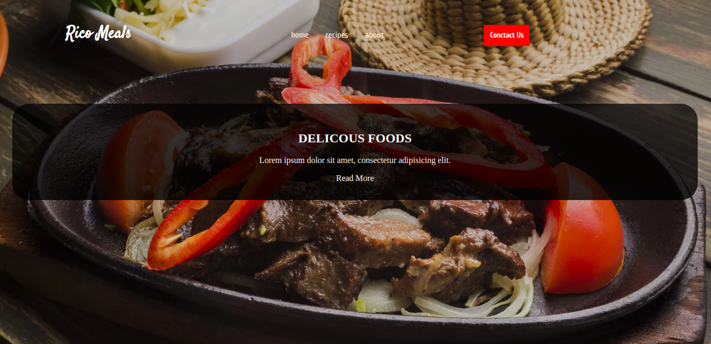
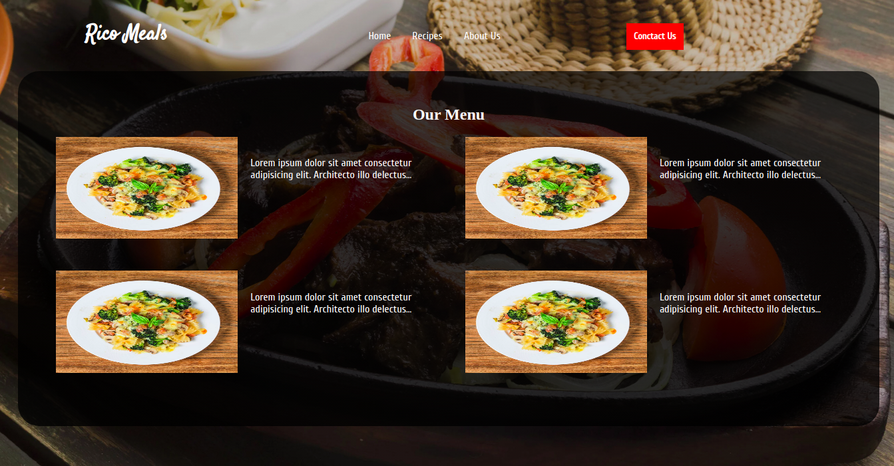
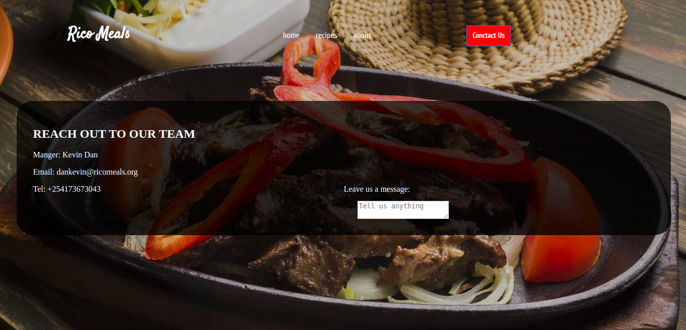

 

  

  <h3 align="center">Rico Meals</h3>

  

    JavaScript Project
     
     
    <a href="https://raw.githack.com/wathigo/Restaurant-Page/recipe-page/dist/index.html">View Demo</a>
    ·
    <a href="https://github.com/wathigo/Restaurant-Page/issues">Report Bug</a>
    ·
    <a href="https://github.com/wathigo/Restaurant-Page/issues">Request Feature</a>
  

<!-- TABLE OF CONTENTS -->
## Table of Contents

* [About the Project](#about-the-project)
  * [Built With](#built-with)
* [Contact](#Contact)

<!-- ABOUT THE PROJECT -->
## About The Project

  

  

  

Based on the [Restaurant Page](https://www.theodinproject.com/courses/javascript/lessons/restaurant-page) in the odin project as a part of the Microverse curriculum. The purpose is to get a good understanding of webpack and npm.

### Built With
* [JavaScript](https://www.javascript.com/)
* [webpack](https://webpack.js.org/)

### Contact

* [Simon Wathigo](https://github.com/wathigo) - wathigosimon@gmail.com - [Linkedin](https://www.linkedin.com/in/simon-wathigo-445370183/)
